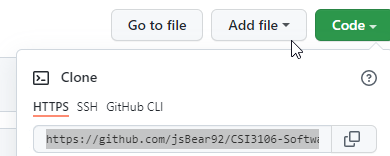

# Software Testing Case Study

## Description
Remote repository for event booking software component system.

## Requirements

1. [git](https://git-scm.com/downloads)
2. IDE: [Eclipse](https://www.eclipse.org/downloads/) (recommended)
3. Open SDK 18


## Setting up your local repository

1. Click the Code button, select **HTTPS** and copy the url.



2. Go to your command line terminal and type: 

```git clone https://github.com/jsBear92/CSI3106-Software_Testing_Group_Project.git```

3. Create your branch off of from the master branch with the naming convention /your-name/test/feature.

```git checkout -b "mike/test/schedule-meeting"```

##  System functionalities

1. Schedule a meeting (Mike)
2. Booking vacation dates     
3. Checking availability for a room (Neb) 
4. Checking availability for a person (Mat)  
5. Check the agenda for a room (James)
6. Check the agenda for a person

## Classes

1. Planner (Main)
2. Meeting     
3. Calender      
4. ConflictsException      
5. Room     
6. Person     
7. Organisation

## Tools and libraries

1. JUnit.*
2. Mockito
3. com.github.stefanbirkner.systemlambda.SystemLambda


